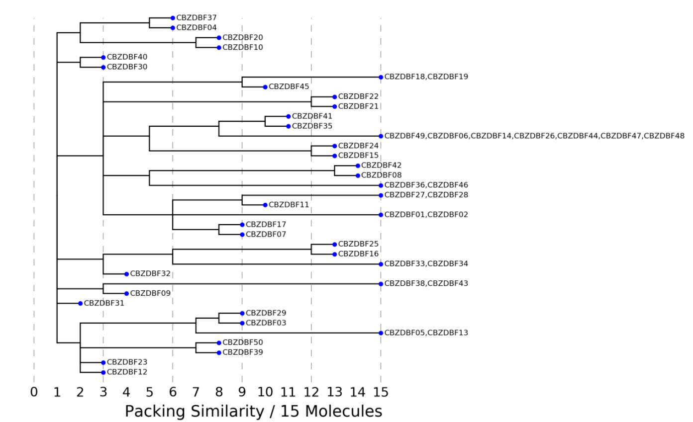
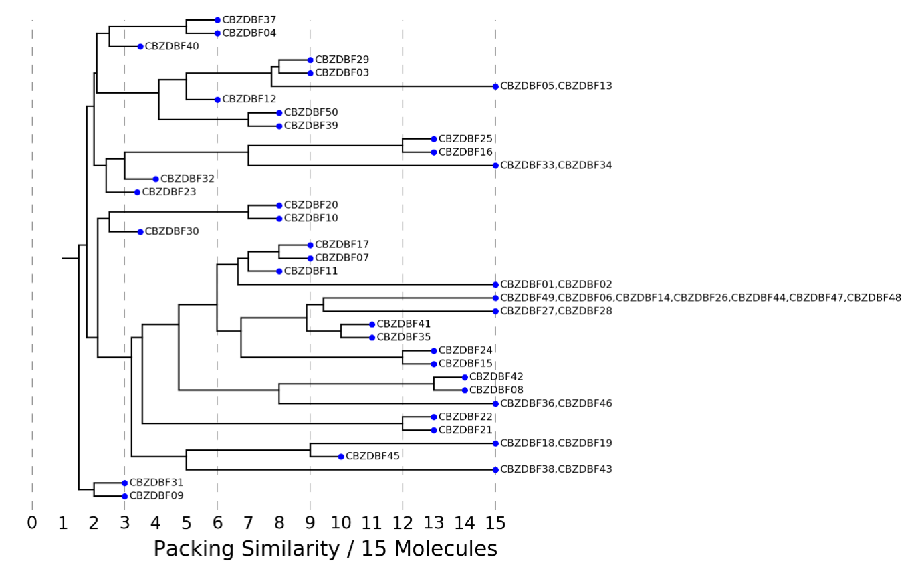

# Packing_Similarity_Dendrogram.py

## Summary:

This command-line script is designed to compare the packing of a set of input structures of a molecule (polymorphs,
co-crystals, solvates, and hydrates). An all-to-all comparison of the structures is performed, considering _only the
heaviest components_ in each structure, and a packing-similarity dendrogram or tree is constructed using hierarchical
clustering. This dendrogram shows the similarity between groups of structures and how these groups relate to one
another.

## Requirements:

CSD Python API (v. 1.0 or later), `matplotlib` and standard python packages.

> Instructions on running example scripts through the CSD-Python API miniconda installation can be found in [the repository ReadMe.md](https://github.com/ccdc-opensource/csd-python-api-scripts#readme)

## Licensing Requirements 
\#TODO [LIST]

## Usage and Output:

`python Packing_Similarity_Dendrogram.py -h` will show the help text:

```
usage: Packing_Similarity_Dendrogram.py [-h] [-m similarity_matrix.txt]
[-ns 25] [-nm 15] [-o]
[--allow_molecular_differences]
[--clustering_type {complete,single,average}]
[-s] [-ct 0.5] [-at 25] [-dt 0.25]
input_file

Packing_Similarity_Dendrogram.py - Construct a dendrogram for an input set of structures based
on packing-similarity analysis

positional arguments:
input_file Set of structures to perform analysis on
[.mol2/cif/res/ind].

optional arguments:

-h, --help show this help message and exit
-m similarity_matrix.txt, --matrix similarity_matrix.txt
NumPy matrix containing existing packing similarity
results.
-ns 25, --n_structures 25
Number of structures to take from input set.
-nm 15, --n_molecules 15
Size of molecular packing shell to use for analysis
(must be consistent with input matrix, if used).
-o Flag for whether to save packing similarity results
(text file and mol2 overlays).
--allow_molecular_differences
Flag for whether to allow for molecular differences
between structures (e.g. for salts).
--clustering_type {complete,single,average}
Type of clustering to employ
-s, --strip Strip all terminal atoms and alkyl chains, up to any
hetero atom (O, N, S) or cyclic atom. This cuts the


molecule down to core structural features and may
reveal more general structural similarities, including
those between molecules with different conformations.

-ct 0.5, --conf_tol 0.
RMSD threshold for considering two conformations to be
the same (when merging at level 1).
-at 25, --angle_tol 25
Tolerance for angles (in degrees) used by packing
similarity.
-dt 0.25, --dist_tol 0.
Fractional tolerance for distances (0.0 - 1.0) used by
packing similarity.
```

Basic usage (in a command prompt) is:

```cmd
python Packing_Similarity_Dendrogram.py input_file
```

where `input_file` should be a format recognised by the CSD Python API (e.g. cif, res, mol2, gcd or ind). The default
output of the tool consists of figures (as .png files) of the packing-similarity dendrogram and a heat map of the
packing similarity between the structures. The file names are prefixed with the stem of the input file ( _i.e._ if
roy.gcd is the input, then the similarity dendrogram will be called `roy_packing_similarity_tree.png`).

If a large set of structures are inputted, the top _N_ structures can be selected using the -nm options.

Using the `-o` option will result in overlays being saved for each comparison (as .mol2 files). The matrix of
similarities is also saved as a raw numpy matrix ( _i.e._ as
`roy_similarity_matrix.txt`), and can be read back in (with `-m`) to skip the packing-similarity analysis, if, for
example, a different clustering algorithm is desired or part of the script has been changed.

The `--allow_molecular_differences` option can be used when comparing crystal structures of closely related molecules _
e.g._ salts and free forms.

The `-s` option will strip all terminal atoms and carbon atom chains up to hetero atoms ( _e.g._
the methyl of a methoxy will be removed), which may be useful for identifying more coarse- grained similarity that
ignores small changes in the periphery of the molecule. A new cif is created containing the stripped molecule and
analysis is performed using this file. Note that disordered experimental structures present in the input database will
cause problems when this option is selected and should be removed from the file.

The remaining options control the packing-similarity settings, such as number of molecules, thresholds etc. Matches of
only one molecule between structures may not necessarily

correspond to good agreement between two conformations (as the distance and angle thresholds can be more coarse-grained
than an RMSD tolerance). The `-ct` option can therefore be used to specific an RMSD tolerance for whether two
conformations are matched and in, turn, whether two clusters that have only one molecule in common should be merged at
that level.

## Understanding the Dendrogram:

An example dendrogram (produced using CBZdataset.ind and related files; see supporting material
of [Cryst. Growth Des., 2009, 9, 1869 _–_ 1888](https://pubs.acs.org/doi/10.1021/cg801056c) ) is shown below in Figure 1. 
To produce this dendrogram, the script compares all 50 structures in the input to each other. For a default cluster
size of 15, the match can range from 0, which indicates a completely different conformation and no similarity in
packing, to 15, where the two structures are isostructural.

In comparing the structures different linkage criteria can be used. The _default behaviour_ is to link structures based
on the smallest difference between them (referred to as single- linkage clustering). Structures are initially grouped
together based on their best matches, such that if A matches B with 15/15 and C with 14/15 and B matches C with 15/15,
then A, B and C are all grouped together at level 15. Groups are then merged with the group which they share the best
overlay, based on a single structure in each group. This means that if D has an 8/15 molecule match with B, then the
group A, B, C will join with D at level 8, even if A and C had smaller similarities with D.

At the highest level ( _e.g._ 15 in the example below) isostructural crystal structures are listed together ( _e.g._
“CBZDBF18, CBZDBF19”). At lower levels, where groups or structures share a similarity then the parent groups are draw
one level higher (with blue dots) and then join at the level they match. For example, structures 37 and 4 at the bottom
of the plot have 5 / molecules in common, so both are drawn at level 6 and then merge at level 5. This group of 37 and 4
then shares a similarity with 32, 09 and 30, as well as all other structures apart from 31 at level 3, so all of them
merge.

Alternative clustering modes can be invoked by using `--clustering_type`, which takes one of three arguments: single,
complete and average. Single linkage clustering is the default discussed above. Complete clustering will instead only
join two clusters at the level where all the structures in the two clusters match, which is equivalent to joining
clusters at the worst or lowest level connecting them. Figure 2 shows the same database as Figure 1 using this approach,
which gives more definite clustering but will also hide some similarities due to the hierarchical nature of the
clustering.


**Figure 1** : Example dendrogram based on a database of carbamazepine solid forms using the default single-linkage
clustering.


**Figure 2** : Example dendrogram based on a database of carbamazepine solid forms using complete- linkage clustering.

The final option for clustering type is to merge clusters based on their average packing- similarity agreement. The
result for carbamazepine is shown in Figure 3. With average linkage clustering, two cluster can join at non-integer
values and therefore the plot may become more complex visually.

There are several alternative schemes for linking clusters ( _e.g._ weighting the average based on the cluster sizes)
that could also be implemented.


**Figure 3** : Example dendrogram based on a database of carbamazepine solid forms linking clusters based on their
average packing similarity.

## Caveats:

The tool considers only the heaviest component in each crystal structure to enable comparison of multi-component forms
with pure forms. Results for _Z_ ’ > 1 systems may not fully reflect differences between structures as the best match is
retained by default in the packing-similarity analysis.

## Authors: 
_Anthony Reilly(2016)_

> For feedback or to report any issues please contact [support@ccdc.cam.ac.uk](support@ccdc.cam.ac.uk)